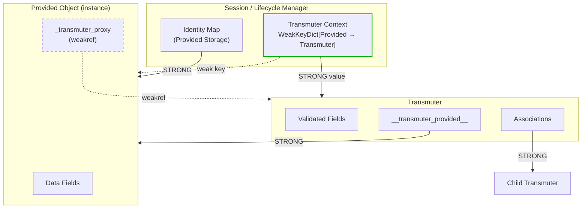
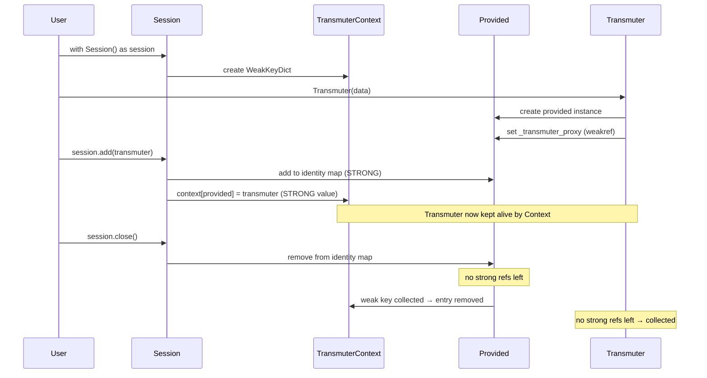
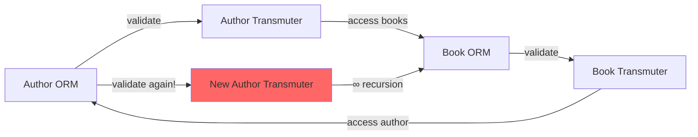
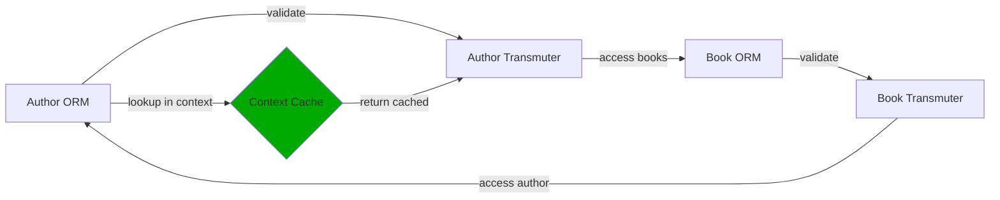

# Lifecycle & Async

A transmuter does not own an independent lifecycle — it **follows its backend**. How that lifecycle
is managed differs by materia, and not every materia has a session at all. This page is the concept;
for the session API and helpers, see [Usage → SQLAlchemy](../usage/sqlalchemy/index.md).

## The transmuter follows its backend

Arcanus never fights the backend's own ownership and transaction semantics. So a transmuter's
lifetime is governed by whatever the backend uses to manage records:

- **No backend (`NoOpMateria`)** — there is **no session**. A transmuter is an ordinary Python
  object: it lives while referenced and is garbage-collected when nothing holds it. Nothing to open,
  flush, or close.
- **A database (`SqlalchemyMateria`)** — a **session** owns the underlying provided instance and
  moves it through *pending → persistent → expired/detached*; the transmuter rides along. The arcanus
  `Session` blesses rows into transmuters on the way out and syncs changes back in, while leaving
  transactions to SQLAlchemy. See
  [object lifecycle under the SQLAlchemy materia](#lifecycle-under-the-sqlalchemy-materia) below for
  the details, and [Session Helpers](../usage/sqlalchemy/session.md) for the API.

Server-generated values (autoincrement ids) land at the backend's boundaries — after `flush` /
`commit` — which is why `revalidate()` exists to pull them into the transmuter.

## Async is about backend I/O

A transmuter is mostly a **synchronous** object — validation, construction, field access, and
mutation run inline, just like the plain Pydantic model underneath. Async enters only where the
**backend does I/O**, which is almost entirely **relationship loading**. So the relationship
associations are made *awaitable*: awaiting one ensures its data is loaded from the backend (loading
only if not already present) and returns the resolved value.

- `await relation` → the related object (same as `relation.value`)
- `await relation_collection` → a `list` of the related objects

```python
async with AsyncSession(async_engine) as session:
    author = await session.get_one(Author, 1)
    books = await author.books          # list[Book]

    book = await session.get_one(Book, 1)
    parent = await book.author          # Author
```

Whether the `await` is *required* depends on the backend's loading strategy. With SQLAlchemy's
default `lazy="select"`, a lazy load triggered outside a coroutine raises a greenlet error, so the
`await` is required; for eager strategies (`selectin`, `joined`) the data is already loaded and the
`await` is optional but recommended for consistency. In-memory backends like `NoOpMateria` never do
I/O, so association access is purely synchronous there.

See the [`arcanus.materia.sqlalchemy` reference](../api/sqlalchemy.md) and
[Loading Strategies](../usage/sqlalchemy/loading.md).

## The reference architecture

What makes "follows its backend" work without leaking memory is the **Transmuter Context** — the
session-scoped cache that maps a provided instance to its transmuter. The hard part of wrapping a
*provided* instance in a Transmuter is maintaining the two-way link **without**:

1. leaking memory through reference cycles,
2. losing a Transmuter prematurely mid-validation, or
3. recursing infinitely on circular relationships (Author → Book → Author).

The solution is a careful mix of strong and weak references, coordinated by that context.



These references are between **instances** — a *provided* object and its transmuter:

| From | To | Type | Why |
|------|----|------|-----|
| `Session` / identity map | Provided | **strong** | The session owns the provided instance's lifecycle. |
| `TransmuterContext` key | Provided | **weak** | Auto-cleanup when the provided instance is collected. |
| `TransmuterContext` value | Transmuter | **strong** | Keeps the transmuter alive while its provided instance lives. |
| `Transmuter.__transmuter_provided__` | Provided | **strong** | The transmuter wraps the provided instance. |
| `Provided._transmuter_proxy` | Transmuter | **weak** | Breaks the otherwise-circular strong reference. |
| `Association` | child transmuters | **strong** | Loaded relationship data is held strongly. |

Because the Provided → Transmuter link is weak, a transmuter is collected once nothing else holds
it — but while a session is open, the Transmuter Context keeps it alive, so you always get the *same*
transmuter back for the same row.

### Lifecycle sequence

End to end — create, add, close — the references hand off like this:



### Lifecycle under the SQLAlchemy materia

The Transmuter Context (the session-scoped validation context above) is what ties the two object
worlds' lifecycles together. With the SQLAlchemy materia this has a concrete and important
consequence:

!!! important "A transmuter's lifecycle follows SQLAlchemy, controlled by the session"
    Under the SQLAlchemy materia, a transmuter does **not** have a lifecycle of its own — it follows
    its provided instance's, and that instance is owned by the **SQLAlchemy session**. The session
    moves the ORM row through *pending → persistent → expired/detached*, and the transmuter rides
    along:

    - It becomes pending on `add`, persistent on `flush`/`commit`.
    - The validation context (a `WeakKeyDictionary` keyed on the provided instance) keeps the
      transmuter alive **only as long as its provided instance lives in the session**. When the
      session expires, expunges, or is closed, that instance is released and the transmuter is
      collected with it.
    - Server-generated values are SQLAlchemy's to produce; `revalidate()` is just the step that
      syncs them into the transmuter after a flush.

    So there is no separate "save the Pydantic object" or "close the transmuter" step. Manage the
    SQLAlchemy `Session` and the transmuters follow. (Under `NoOpMateria` there is no session at all,
    so transmuters simply live and die as ordinary Python objects.)

## The circular-validation problem

Validating a bidirectional relationship would recurse forever without caching: validating the
Author reaches a Book, which reaches the Author again, which would build a *new* Author transmuter,
and so on:



The Transmuter Context breaks the cycle — the second time a provided instance is seen, its
already-built Transmuter is returned from the cache instead of being re-created:


