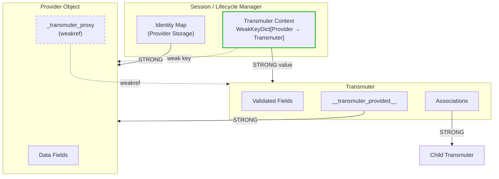
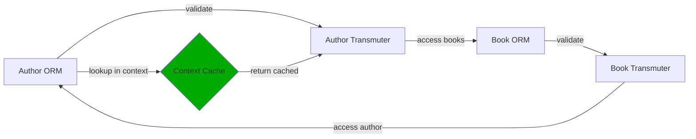

# The Materia System

A **Materia** is the plugin that connects transmuters to a concrete backend. It is the layer that
makes "one object, not two" possible: it knows how to turn a backend record (a *Provider*) into a
validated transmuter and how to keep the two in sync.

## Core vocabulary

| Term | Meaning |
|------|---------|
| **Transmuter** | The Pydantic object you work with. Validates, and wraps a Provider. |
| **Provider** | The backend-managed object behind a transmuter (e.g. a SQLAlchemy ORM instance). |
| **Materia** | The plugin binding transmuters to a backend (`SqlalchemyMateria`, `NoOpMateria`, …). |
| **Transmuter Context** | A session-scoped cache mapping Provider → Transmuter. |

## Binding with `bless()`

`bless()` registers a two-way mapping between a transmuter class and a provider class. After
blessing, the materia can construct a transmuter from any provider instance it sees — for example,
every ORM row a `Session` returns:

```python
materia = SqlalchemyMateria()

@materia.bless(AuthorModel)     # Author transmuter  <->  AuthorModel provider
class Author(BaseTransmuter):
    ...
```

The default `NoOpMateria` needs no blessing at all — it is active automatically, which is why
transmuters behave like plain Pydantic models out of the box.

## Design philosophy: respect the backend

Arcanus's guiding rule is that it **never fights the target backend's session, atom, and
transaction semantics** — it cooperates with them:

- **Defer, don't pre-load.** Relationships are marked deferred during validation and only loaded on
  access, so Arcanus honors the backend's own lazy-loading strategy instead of forcing eager I/O.
- **Don't duplicate the identity map.** Within a session, a given provider always resolves to the
  *same* transmuter. Arcanus leans on the backend's identity map rather than inventing a second one.
- **Sync at the backend's boundaries.** Server-generated values land after `flush`/`commit`; you
  pull them into the transmuter with `revalidate()`. Transactions remain the backend's job.

A new backend is "correct" precisely when it upholds these guarantees.

## The reference architecture

The hard part of wrapping a Provider in a Transmuter is maintaining a two-way link **without**:

1. leaking memory through reference cycles,
2. losing a Transmuter prematurely mid-validation, or
3. recursing infinitely on circular relationships (Author → Book → Author).

The solution is a careful mix of strong and weak references, coordinated by the session-scoped
**Transmuter Context**.



| From | To | Type | Why |
|------|----|------|-----|
| `Session` / identity map | Provider | **strong** | The session owns the provider's lifecycle. |
| `TransmuterContext` key | Provider | **weak** | Auto-cleanup when the provider is collected. |
| `TransmuterContext` value | Transmuter | **strong** | Keeps the transmuter alive while its provider lives. |
| `Transmuter.__transmuter_provided__` | Provider | **strong** | The transmuter wraps the provider. |
| `Provider._transmuter_proxy` | Transmuter | **weak** | Breaks the otherwise-circular strong reference. |

Because the Provider → Transmuter link is weak, a transmuter is collected once nothing else holds
it — but while a session is open, the Transmuter Context keeps it alive, so you always get the *same*
transmuter back for the same row.

## The circular-validation problem

Validating a bidirectional relationship would recurse forever without caching: validating the
Author reaches a Book, which reaches the Author again. The Transmuter Context breaks the cycle — the
second time a Provider is seen, its already-built Transmuter is returned from the cache instead of
being re-created.



## Implementing a new Materia

Building a backend means upholding the guarantees above. In short:

1. **Provider mixin** — provider objects implement `TransmuterProxiedMixin`, which supplies the
   weak `_transmuter_proxy` back-reference.
2. **Session / context manager** — own a `WeakKeyDictionary[Provider, Transmuter]` and activate it
   as the validation context for the session's lifetime.
3. **Registration** — `bless()` records the Transmuter ↔ Provider mapping on the materia.

!!! note "Memory-safety checklist"
    - Provider → Transmuter is a **weakref**.
    - The context is a **`WeakKeyDictionary`** (weak keys, strong values).
    - The session holds providers **strongly**; the transmuter holds its provider **strongly**.
    - There is **no other** strong reference from Provider back to Transmuter.

The full reference design, lifecycle sequence, and test recipes live in
[`arcanus/materia/README.md`](https://github.com/kalynnka/arcanus/blob/main/arcanus/materia/README.md).
